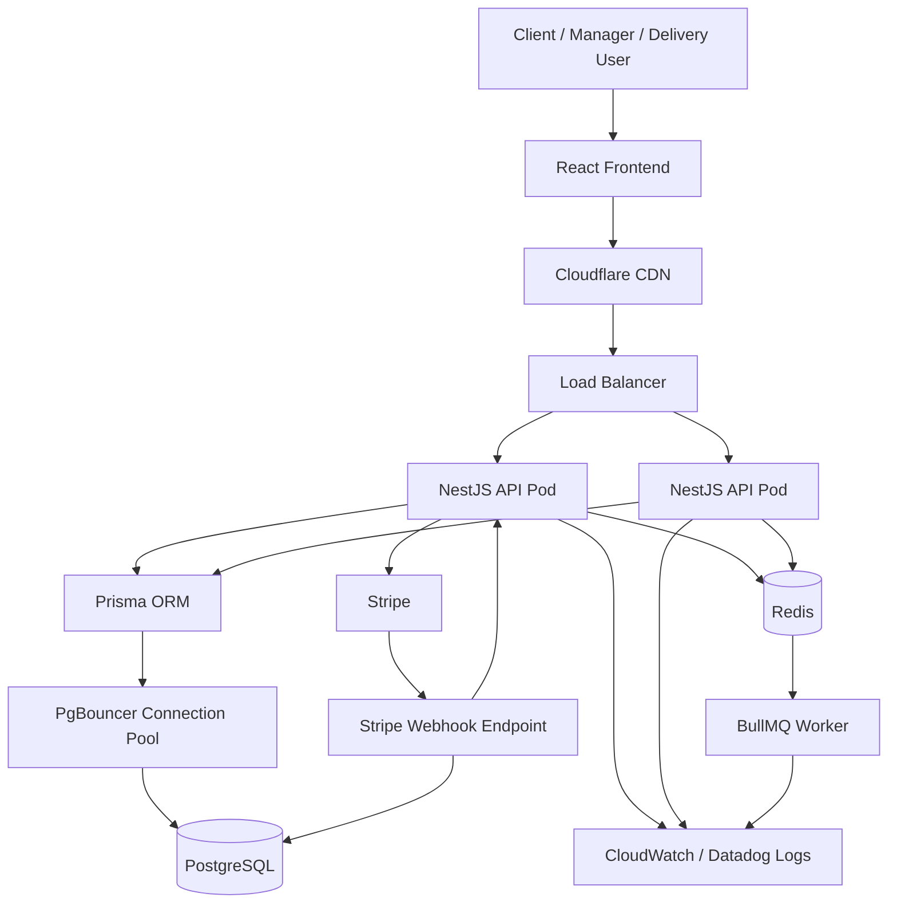

# Open Page Architecture Diagram

## T-Shirt Store API

## Main Runtime Flow

1. Users access the React frontend and authenticate with JWT access tokens plus refresh tokens.
2. The frontend calls the NestJS API through the load balancer.
3. NestJS validates requests with DTOs, guards, role checks, and service-layer business rules.
4. Prisma accesses PostgreSQL through a connection pool to avoid exhausting database connections.
5. Stripe Payment Links handle checkout payment collection.
6. Stripe webhooks confirm payment success, payment failure, or expiration.
7. Successful payment webhooks update the order, store the webhook event, decrement stock, and create inventory movements.
8. Redis and BullMQ support asynchronous work such as notifications and retryable background jobs.

## Core Components

| Component | Responsibility |
| --- | --- |
| React Frontend | Product browsing, cart, checkout, profile, orders, manager tools |
| NestJS API | Auth, products, variants, cart, orders, payments, promos, delivery, notifications |
| PostgreSQL | Source of truth for users, products, carts, orders, payments, webhooks, stock, likes |
| Prisma | Type-safe database access and migrations |
| Redis / BullMQ | Queue infrastructure for async jobs and retries |
| Stripe | Payment collection and payment lifecycle events |
| Webhook table | Idempotency record for Stripe events already received |

## Access Boundaries

| Role | Main permissions |
| --- | --- |
| Client | Browse products, like products, manage cart, checkout, manage addresses, view own orders |
| Manager | Manage products, variants, images, promotions, and order statuses |
| Delivery person | View assigned delivery orders and mark shipped orders as delivered |

## Reliability Notes

- API pods are stateless and can scale horizontally.
- Refresh tokens are stored hashed in the database and can be revoked.
- Stripe webhook events are stored before processing to avoid duplicate handling.
- Stock is decremented only after confirmed payment success.
- Failed or expired Stripe payments update payment/order state without reducing inventory.
